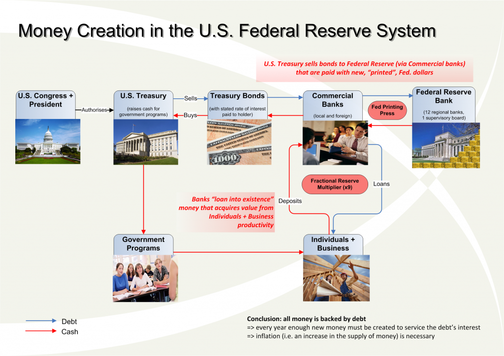

# 前言

这是区块链相关知识的一个梳理，旨在真正的get the skill并方便他人。

知识可分为两类:

* **逻辑体系型的**

  需要思考，把各种概念连起来，或归纳，或演绎，最后，在大脑中形成一种逻辑网状结构。比如可计算理论，分布式系统，解释器等。

* **使用操作型的**

  基本不需要思考，只需要看一下目录，要用的时候参考一下手册即可。比如linux的各种命令，go,python的一些奇怪语法,elastic-search dsl的使用。

第一类知识是比较有意思的，值得多花时间，这种"逻辑网状结构"最后会形成一个"打通"的集群，可能会让你的大脑产生一些有意思的想法；而第二类，千万别花太多时间，因为很有可能让你产生消极，厌学，忧郁等情绪，而你越努力，就越可能"斯德哥尔摩"。

区块链知识可以归为第一类。

研究一个东西，需要知道它包含哪些概念，我把它分为两类:

* **自描述概念**

  不依赖其他概念的概念
* **他描述概念**

  需要依赖其他概念的概念

显然，这是一个递归的概念，可以用形式化的语言来描述，你也可以哲学的扯一大堆，但这不是我的兴趣。
下面的章节试图用*原理，逻辑，应用*的方式把区块链相关的概念连起来，形成”网状结构“，所有概念可在Glossary里查看，你可以先浏览一下，想一想他们之间的关系，再来看下面的章节。当然，最后，每个人的"网状结构"可能都不同，毕竟除了"同一性"，还有"差异性"。但，原则是一致的，有了"网状结构"，在添加新的"概念"时，我们就可以审视其在"网"中的位置，也可以思考这张"网"还缺少什么，有什么不完美之处，是不是还有"孤岛"等问题，进而有可能去完善它。

# 原理

## 1. KV(key value)

>There are only two hard things in Computer Science: cache invalidation and _**naming things**_.
>
>-- Phil Karlton

为什么名字那么重要？因为有了名字，这个名字才能够被引用，才能够谈论其属性。

就是说，你要谈论一个人，首先得有这个人，这有点废话，但却是原理性的，

名字意味着什么？

图灵机里面的head,没错，只有你找到head,才知道当前的(input,state),才能往下走。

汇编语言如果没有address,存储和操作也没法进行;各种编程语言的变量说的也是这个事情。

而kv中的k其实就是名字，v在不同的场合可以有不同的含义。

有了kv,就可以构造所有的数据结构，因为从递归的角度，v也可以是kv。

这个跟blockchain有关系吗？

## 2. Asset(资产)

在digital asset的世界，address上的数字就是资产。显然，address是key,数字是value。
理解这一点很重要，blockchain主要主要的应用场景就是数字资产。

## 3. Transaction(交易)

而address上的数字的变更，也就是kv的变化，对应着资产的转移，就是**交易(transaction)**。

## 4. Currency issuance(货币发行)

### 4.1 美元的发行流程

* 没钱花了，国会和总统授权财政部,发行国债
* 国债大部分卖给中国和日本，有钱了
* 又没钱花了，中国日本也不要，通过银行卖给美联储，有钱了，这个钱是凭空出来的，**Currency issuance(货币发行)** works
* 债券是有利率的，就是说偿还债务时需要比借的钱要多一些
* 而发行的钱=借出的钱，这多一些的钱从哪里来呢？
* 唯一的办法就是继续借，也就是继续发行，否则这个系统就没法运转下去

这个系统的必然结果是:

* inflation(通货膨胀)
* 在经济增长对货币需求量增加的情况下，债务只可能越来越大
* 但是，只要有信心，这个系统就可以一直运行下去
* 并且，似乎其还有一个作用，生产力高的人更容易获得金钱
* 因为如果你赚的钱如果不足以覆盖你使用钱的成本，你就会被淘汰
* 这个系统不完美，但支撑了资本主义的高速发展
* 似乎繁荣,萧条的周期跟这个系统有很大的关系
* 它还在高速运转

### 4.2 比特币的发行流程

比特币的创世区块，上面有一句话:

>“The Times 03/Jan/2009 Chancellor on brink of second bailout for banks"
“财政大臣站在第二次救助银行的边缘”

这句话是当天泰晤士报头版的标题。中本聪将它写进创世区块，不但清晰地展示着比特币的诞生时间，还表达着对旧体系的嘲讽。

## 4. 交易网络
而整个比特币就是围绕怎么*确保某个address的数字只能由拥有它的人来操作*而展开的，当然，它还干了其他几件牛B的事情：

* 在去中心化的条件下解决spend twice的问题
* 防止通货膨胀的货币发行机制
* 交易记录无法篡改

去中心化对区块链来说并不是一个必选项，就大部分的商业活动看，去中心化反而会增加很多不必要的复杂性。

发币也不是必选项。

所以，我们先来看如何做到*确保某个address的数字只能由拥有它的人来操作*和*交易记录无法篡改*

## 3. Asymmetric cryptography(非对称加密)

* 公钥加密，只有对应的私钥能够解密

  加密货币中的address对应公钥(bitcoin的实现里面，为了隐藏身份，对public key做了hash),对该address的资产进行操作的唯一条件是:拥有对应的私钥。

* 私钥签名，公钥能够验证是不是对应的私钥签名的

  把公钥和签名广播出去，nodes可以验证交易的有效性。

* 篡改无效
  签名的信息确实是签名者本人的意愿，nodes能对此进行确认。

* PKI中利用CA颁发证书的方式来确定网络中的身份
  >对于公有链，peer可以自由加入，退出，并不需要一个中心化的CA来对身份进行认证
  >
  >联盟链，peer的身份和权限可利用该机制来实现，比如hyperledger中的msp

## 4. Hash的特性

* 任意长度的数据->固定长度的数据
* 相同input->相同output
* 冲突几率很小,改变input的一个字符，output都会不同
* 验证hash value很容易，反推很难
  >计算一个任意长度input的hash value非常快，但是给出一个output，要算出input却非常难，目前只有遍历试验的方法。Bitcoin中会根据目前的平均出块速度，给出一个ouput,谁先构造出hash(input)小于该output的数据，谁就拥有当前出块的权利。这个遍历试验的过程就叫做**挖矿(mining)**，当某个peer找到符合条件的input,它会广播给其他peer,其他peer对其进行验证，这个遍历试验并向大家证明的过程，就叫做**POW**;而每一次出块会有一定的奖励，这个奖励是比特币产生(coinbase)的唯一方式,而区块中确认交易的output和input的差额就是给记账peer的**手续费(transaction fee)**。

## 5. 数据结构

* 分布式存储

  结构是那样的结构，但是block chain的数据是存在peers中的，new block的增加会由某个peer发起，广播给其他peer,然后根据consensus mechanism来决定验证该block是否有效。

* consensus mechanism

  就是peers产生block,验证block的机制，目标是保证数据的有效性，正确性，"不可篡改"。

* 不可篡改

  首先，"不可篡改“是指整个分布式网络对外提供的block chain data是"不可篡改"的。恶意节点的篡改，得不到承认，并且不影响对外的服务。

  下面结合block chain的具体结构和相应的consensus mechanism来说明,why"不可篡改"?

  block chain数据结构的特点是:链式存储，且每一个block(Genesis block除外)有上一个block的hash。
  由于hash的"冲突几率很小,改变input的一个字符，output都会不同"的特性，改变一个区块的数据将会导致后面区块的hash对不上，也许你会说,"改变后面block的hash不就行了？"，但是，由于后面的block也改变了，那么其hash也改变了，而一个block有效的一个必要条件:  
  >hash(block)<根据当前平均出块速度计算出的output

  也就是说，你需要重新构造数据，也就是重新寻找nonce,而这是非常难的,并且整个系统中peers只认最长的block，也就是说你要跟所有honest peers竞争，理论上，掌握51%以上的算力是有可能对数据进行篡改的，但是，假如你的算力真的非常强，你可以把交易都篡改了，这是否能让你的利益最大化呢？首先，这个篡改肯定会被发现，当honest peers发现很长的不匹配block时，会发出告警，然后用户也会知道，这会导致什么结果呢？一个必然的结果是：系统无法被人信任，价值归0。而拥有强大的算力，并且选择做honest peer，你会获得不错的稳定收益;这就导致强大的算力更倾向于做honest peer,而拥有越多强大算力的honest peer,整个系统就越难被攻破。这就是人性，这就是市场。

  所以，比特币里面不可篡改的保证靠的是:POW+block chain存储+激励措施的博弈

  但是，这里一个很致命的问题是:POW太浪费电了......

  那么，有没有既不浪费电又能够保证"不可篡改"的办法呢？

  至少，在"去中心化"的条件下是很难实现的。

  * PoS(Proof of Stake)

    相当于越有钱，越有话语权(挖矿或者确认交易)，意思是越有钱越想维持这个系统，越不会想破坏这个系统，从而数据也是"不可篡改的";但是，这个将导致一个很明显的结果:有钱的会越来越有钱。越来越集中化。

  * PBFT(Practical Byzantine Fault Tolerance )?

    意思是n个peers互相交换对new block的看法，然后honest peer取majority(n-1)的看法来决定new block是否合法,可以证明，只要坏人不超过 (n-1) / 3 ，整个系统就是按honest peer来运行的。

    "不可篡改"的保证在于:你需要majority的同意(一般通过签名来保证)，而少数恶意节点显然做不到。

  为了交易速度和省电，目前很多加密货币采用了Pos;而PBFT由于需要知道有多少其他peers并能识别其签名，一般适合私有链，联盟链。

## 6. 交易

