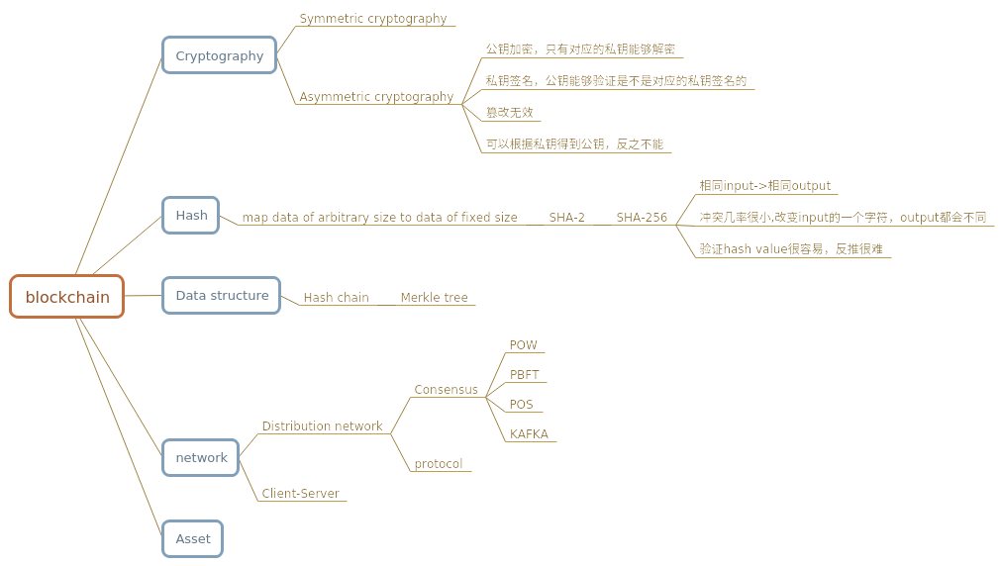
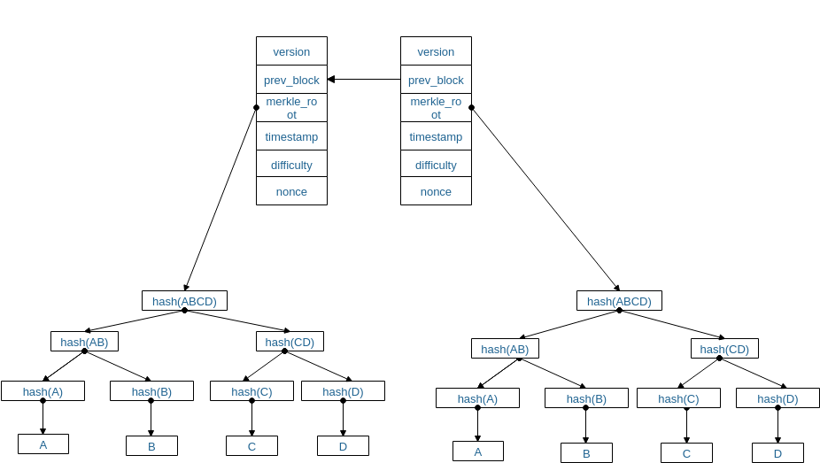
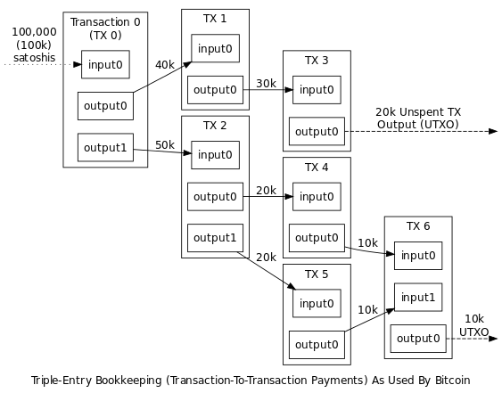

# 原理
## 1. 基础

### 1.1 非对称加密的特性  
* 公钥加密，只有对应的私钥能够解密  
  >加密货币中的address对应公钥(bitcoin的实现里面，为了隐藏身份，对public key做了hash),对该address的资产进行操作的唯一条件是:拥有对应的私钥。

* 私钥签名，公钥能够验证是不是对应的私钥签名的  
  >把公钥和签名广播出去，nodes可以验证交易的有效性。

* 篡改无效  
  >签名的信息确实是签名者本人的意愿，nodes能对此进行确认。

* PKI中利用CA颁发证书的方式来确定网络中的身份  
  >对于公有链，peer可以自由加入，退出，并不需要一个中心化的CA来对身份进行认证  
  联盟链，peer的身份和权限可利用该机制来实现，比如hyperledger中的msp

### 1.2 Hash的特性
* 任意长度的数据->固定长度的数据
* 相同input->相同output
* 冲突几率很小,改变input的一个字符，output都会不同
* 验证hash value很容易，反推很难
  >计算一个任意长度input的hash value非常快，但是给出一个output，要算出input却非常难，目前只有遍历试验的方法。Bitcoin中会根据目前的平均出块速度，给出一个ouput,谁先构造出hash(input)小于该output的数据，谁就拥有当前出块的权利。这个遍历试验的过程就叫做挖矿(mining)，当某个peer找到符合条件的input,它会广播给其他peer,其他peer对其进行验证，这个遍历试验并向大家证明的过程，就叫做POW;而每一次出块会有一定的奖励，这个奖励是比特币产生的唯一方式,而区块中确认交易的output和input的差额就是给记账peer的手续费(transaction fee)。
### 1.2 数据结构

* 分布式存储

  结构是那样的结构，但是block chain的数据是存在peers中的，new block的增加会由某个peer发起，广播给其他peer,然后根据consensus mechanism来决定验证该block是否有效。

* consensus mechanism

  就是peers产生block,验证block的机制，目标是保证数据的有效性，正确性，"不可篡改"。

* 不可篡改

  首先，"不可篡改“是指整个分布式网络对外提供的block chain data是"不可篡改"的。恶意节点的篡改，得不到承认，并且不影响对外的服务。

  下面结合block chain的具体结构和相应的consensus mechanis来说明,why"不可篡改"?

  block chain数据结构的特点是:链式存储，且每一个block(Genesis block除外)有上一个block的hash。
  由于hash的"冲突几率很小,改变input的一个字符，output都会不同"的特性，改变一个区块的数据将会导致后面区块的hash对不上，也许你会说,"改变后面block的hash不就行了？"，但是，由于后面的block也改变了，那么其hash也改变了，而一个block有效的一个必要条件:  
  >hash(block)<根据当前平均出块速度计算出的output
  
  也就是说，你需要重新构造数据，也就是重新寻找nonce,而这是非常难的,并且整个系统中peers只认最长的block，也就是说你要跟所有honest peers竞争，理论上，掌握51%以上的算力是有可能对数据进行篡改的，但是，假如你的算力真的非常强，你可以把交易都篡改了，这是否能让你的利益最大化呢？首先，这个篡改肯定会被发现，当honest peers发现很长的不匹配block时，会发出告警，然后用户也会知道，这会导致什么结果呢？一个必然的结果是：系统无法被人信任，价值归0。而拥有强大的算力，并且选择做honest peer，你会获得不错的稳定收益;这就导致强大的算力更倾向于做honest peer,而拥有越多强大算力的honest peer,整个系统就越难被攻破。这就是人性，这就是市场。

  所以，比特币里面不可篡改的保证靠的是:POW+block chain存储+激励措施的博弈

  但是，这里一个很致命的问题是:POW太浪费电了......

  那么，有没有既不浪费电又能够保证"不可篡改"的办法呢？

  至少，在"去中心化"的条件下是很难实现的。

  * PoS(Proof of Stake)

    相当于越有钱，越有话语权(挖矿或者确认交易)，意思是越有钱越想维持这个系统，越不会想破坏这个系统，从而数据也是"不可篡改的";但是，这个将导致一个很明显的结果:有钱的会越来越有钱。越来越集中化。

  * PBFT(Practical Byzantine Fault Tolerance )?

    意思是n个peers互相交换对new block的看法，然后honest peer取majority(n-1)的看法来决定new block是否合法,可以证明，只要坏人不超过 (n-1) / 3 ，整个系统就是按honest peer来运行的。

  为了交易速度和省电，目前很多加密货币采用了Pos;而PBFT由于需要有多少其他peers，一般适合私有链，联盟链。
## 3. 资产(Asset)

## 4. 交易

